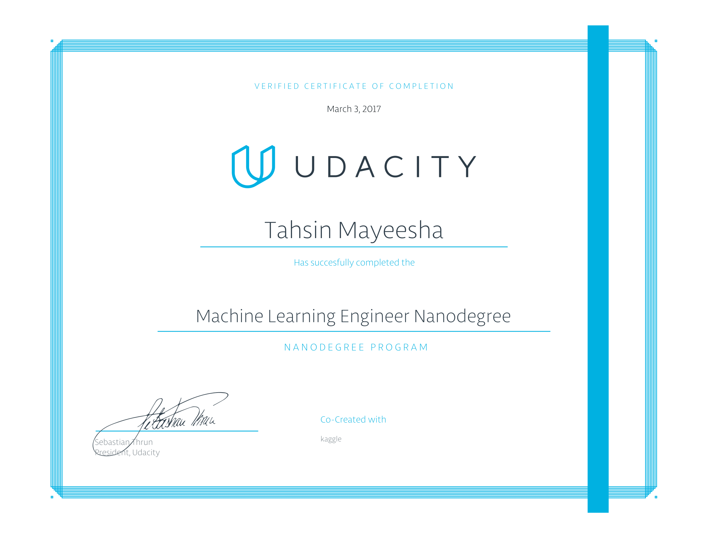

# Udacity-Machine-Learning-Nanodegree

## About 

This repo contains the coursework from Udacity's Machine Learning Nanodegree from June 2016-Feb 2017.

## Projects

* P1 - [Exploring Titanic Survival(Optional)](https://github.com/Tahsin-Mayeesha/Udacity-Machine-Learning-Nanodegree/tree/master/projects/titanic_survival_exploration)
* P2 - [Predicting Boston Housing Prices](https://github.com/Tahsin-Mayeesha/Udacity-Machine-Learning-Nanodegree/tree/master/projects/boston_housing)
* P3 - [Building a Student Intervention System for Struggling Students](https://github.com/Tahsin-Mayeesha/Udacity-Machine-Learning-Nanodegree/tree/master/projects/student_intervention)
* P3 - [Creating Customer Segments from Wholesale Distributor Data](https://github.com/Tahsin-Mayeesha/Udacity-Machine-Learning-Nanodegree/tree/master/projects/creating_customer_segments)
* P4 - [Training a Smartcab to drive with Q-Learning](https://github.com/Tahsin-Mayeesha/Udacity-Machine-Learning-Nanodegree/tree/master/projects/smartcab)

## Coursework

* [Intro to Data Science](https://www.udacity.com/courses/intro-to-data-science--ud359)
* [Intro to Machine Learning](https://www.udacity.com/course/intro-to-machine-learning--ud120)
* [Georgia Tech : Machine Learning](https://www.udacity.com/course/machine-learning--ud262)
* [Reinforcement Learning](https://www.udacity.com/courses/reinforcement-learning--ud600)

