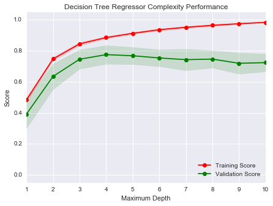

# Project 1: Model Evaluation & Validation
## Predicting Boston Housing Prices

This project uses supervised learning techniques to predict the price of houses in boston area from the provided features. It's a classic dataset, provided by both [UCI Machine Learning Repository](https://archive.ics.uci.edu/ml/datasets/Housing) and included in many libraries in python. I used a DecisionTreeRegressor model with variying depth to compare model accuracy and ultimately compared it to a K-nearest neighbor model after turning the max_depth of Decision Tree and n_neighbors of the K-nearest. The best performing model is a Decision Tree with max_depth of 4 which yields about 0.8 in score. The evaluation metric for this project is R^2.




### Install

This project requires **Python 2.7** and the following Python libraries installed:

- [NumPy](http://www.numpy.org/)
- [matplotlib](http://matplotlib.org/)
- [scikit-learn](http://scikit-learn.org/stable/)

You will also need to have software installed to run and execute an [iPython Notebook](http://ipython.org/notebook.html)

### Run

In a terminal or command window, navigate to the top-level project directory `boston_housing/` (that contains this README) and run one of the following commands:

```ipython notebook boston_housing.ipynb```  
```jupyter notebook boston_housing.ipynb```

This will open the iPython Notebook software and project file in your browser.
