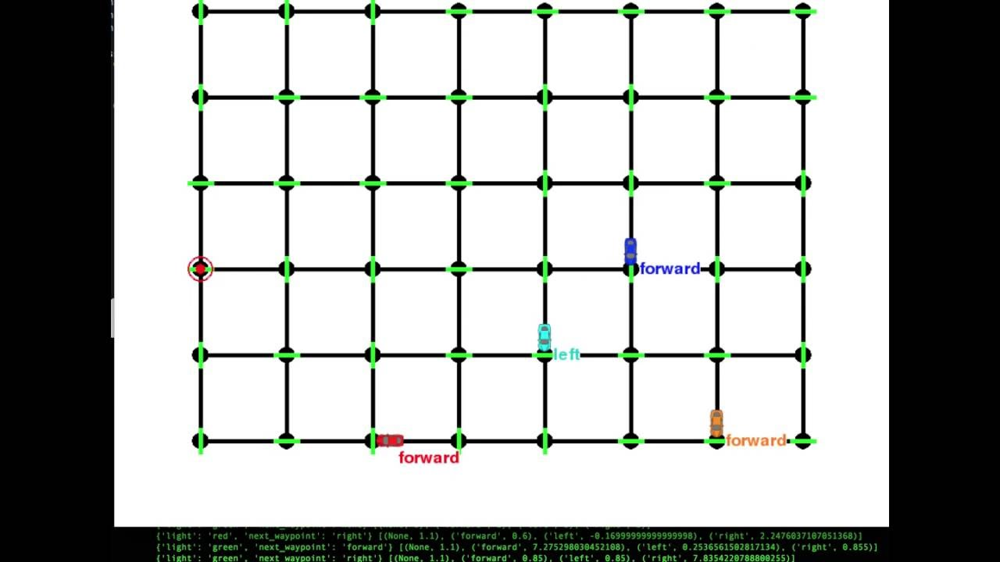
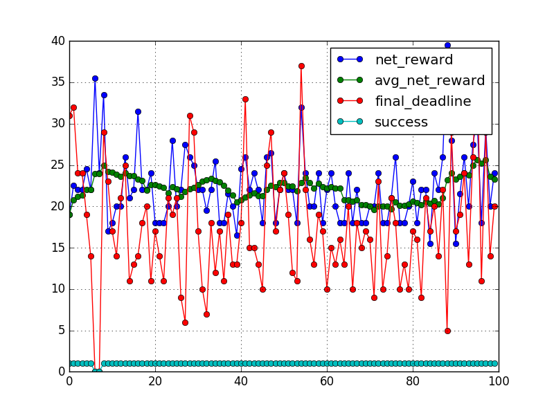

# Project 4: Reinforcement Learning
## Train a Smartcab How to Drive

### Install

This project requires **Python 2.7** with the [pygame](https://www.pygame.org/wiki/GettingStarted) library installed.

### Overview 




The smartcab operates in a grid like city with other agents. Per trial the smarcab gets assigned a goal end point and starts moving there from a given random start point. I've implemented Q-learning algorithm to teach the smartcab how to reach the goal state while avoiding other agents and avoiding penalties. Penalty is given when the smartcab violates a traffic law or collides with other agents. Final Q-learning model with tuned hyper-parameters achieves 99% accuracy.



### Code

Template code is provided in the `smartcab/agent.py` python file. Additional supporting python code can be found in `smartcab/enviroment.py`, `smartcab/planner.py`, and `smartcab/simulator.py`. Supporting images for the graphical user interface can be found in the `images` folder. 

### Run

In a terminal or command window, navigate to the top-level project directory `smartcab/` (that contains this README) and run one of the following commands:

```python smartcab/agent.py```  
```python -m smartcab.agent```

This will run the `agent.py` file and execute your agent code.
