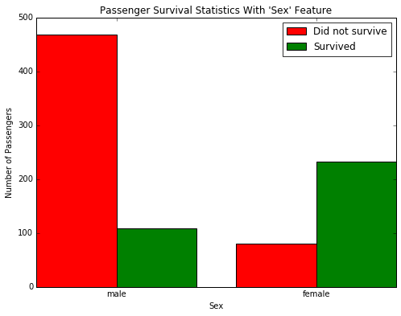

# Project 0: Introduction and Fundamentals
## Titanic Survival Exploration

### Install

This project requires **Python 2.7** and the following Python libraries installed:

- [NumPy](http://www.numpy.org/)
- [Pandas](http://pandas.pydata.org)
- [matplotlib](http://matplotlib.org/)
- [scikit-learn](http://scikit-learn.org/stable/)

You will also need to have software installed to run and execute an [iPython Notebook](http://ipython.org/notebook.html)

### Overview 

This is an optional exploratory project to see which variables are more important for predicting titanic survival. It's more of a 'hello world' project for machine learning.



### Code

Template code is provided in the notebook `titanic_survival_exploration.ipynb` notebook file. Additional supporting code can be found in `titanic_visualizations.py`. 

### Run

In a terminal or command window, navigate to the top-level project directory `titanic_survival_exploration/` (that contains this README) and run one of the following commands:

```ipython notebook titanic_survival_exploration.ipynb```
```jupyter notebook titanic_survival_exploration.ipynb```

This will open the iPython Notebook software and project file in your browser.

## Data

The dataset used in this project is included as `titanic_data.csv`. This dataset is provided by Udacity and contains the following attributes:

- `survival` ? Survival (0 = No; 1 = Yes)
- `pclass` ? Passenger Class (1 = 1st; 2 = 2nd; 3 = 3rd)
- `name` ? Name
- `sex` ? Sex
- `age` ? Age
- `sibsp` ? Number of Siblings/Spouses Aboard
- `parch` ? Number of Parents/Children Aboard
- `ticket` ? Ticket Number
- `fare` ? Passenger Fare
- `cabin` ? Cabin
- `embarked` ? Port of Embarkation (C = Cherbourg; Q = Queenstown; S = Southampton)